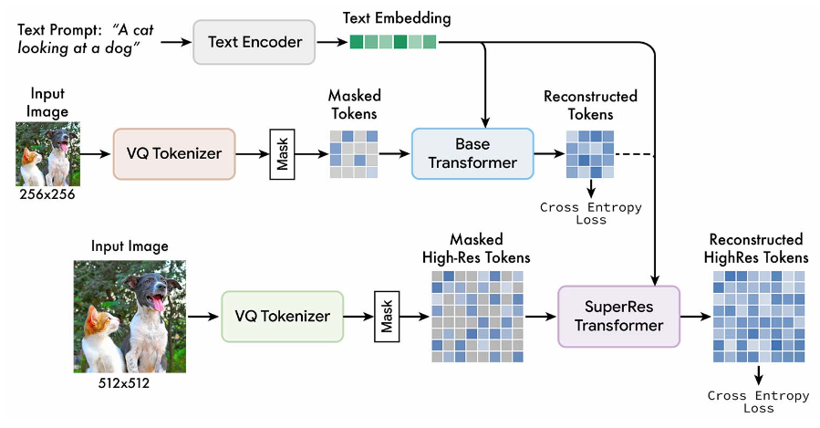

</img>

## Muse - Pytorch

Implementation of <a href="https://muse-model.github.io/">Muse</a>: Text-to-Image Generation via Masked Generative Transformers, in Pytorch

## Install

```bash
$ pip install muse-maskgit-pytorch
```

## Usage

First train your VAE - `VQGanVAE`

```python
import torch
from muse_maskgit_pytorch import VQGanVAE, VQGanVAETrainer

vae = VQGanVAE(
    dim = 256,
    vq_codebook_size = 512
)

# train on folder of images, as many images as possible

trainer = VQGanVAETrainer(
    vae = vae,
    image_size = 128,             # you may want to start with small images, and then curriculum learn to larger ones, but because the vae is all convolution, it should generalize to 512 (as in paper) without training on it
    folder = '/path/to/images',
    batch_size = 4,
    grad_accum_every = 8,
    num_train_steps = 50000
).cuda()

trainer.train()
```

Then pass the trained `VQGanVAE` and a `Transformer` to `MaskGit`

```python
import torch
from muse_maskgit_pytorch import VQGanVAE, MaskGit, Transformer

# first instantiate your vae

vae = VQGanVAE(
    dim = 256,
    vq_codebook_size = 512
).cuda()

vae.load('/path/to/vae.pt') # you will want to load the exponentially moving averaged VAE

# then you plug the vae and transformer into your MaskGit as so

# (1) create your transformer / attention network

transformer = Transformer(
    num_tokens = 512,         # must be same as codebook size above
    seq_len = 256,            # must be equivalent to fmap_size ** 2 in vae
    dim = 512,                # model dimension
    depth = 8,                # depth
    dim_head = 64,            # attention head dimension
    heads = 8,                # attention heads,
    ff_mult = 4,              # feedforward expansion factor
    t5_name = 't5-small',     # name of your T5
)

# (2) pass your trained VAE and the base transformer to MaskGit

base_maskgit = MaskGit(
    vae = vae,                 # vqgan vae
    transformer = transformer, # transformer
    image_size = 256,          # image size
    cond_drop_prob = 0.25,     # conditional dropout, for classifier free guidance
).cuda()

# ready your training text and images

texts = [
    'a child screaming at finding a worm within a half-eaten apple',
    'lizard running across the desert on two feet',
    'waking up to a psychedelic landscape',
    'seashells sparkling in the shallow waters'
]

images = torch.randn(4, 3, 256, 256).cuda()

# feed it into your maskgit instance, with return_loss set to True

loss = base_maskgit(
    images,
    texts = texts
)

loss.backward()

# do this for a long time on much data
# then...

images = base_maskgit.generate(texts = [
    'a whale breaching from afar',
    'young girl blowing out candles on her birthday cake',
    'fireworks with blue and green sparkles'
], cond_scale = 3.) # conditioning scale for classifier free guidance

images.shape # (3, 3, 256, 256)
```


To train the super-resolution maskgit requires you to change 1 field on `MaskGit` instantiation (you will need to now pass in the `cond_image_size`, as the previous image size being conditioned on)

Optionally, you can pass in a different `VAE` as `cond_vae` for the conditioning low-resolution image. By default it will use the `vae` for both tokenizing the super and low resoluted images.

```python
import torch
import torch.nn.functional as F
from muse_maskgit_pytorch import VQGanVAE, MaskGit, Transformer

# first instantiate your ViT VQGan VAE
# a VQGan VAE made of transformers

vae = VQGanVAE(
    dim = 256,
    vq_codebook_size = 512
).cuda()

vae.load('./path/to/vae.pt') # you will want to load the exponentially moving averaged VAE

# then you plug the VqGan VAE into your MaskGit as so

# (1) create your transformer / attention network

transformer = Transformer(
    num_tokens = 512,         # must be same as codebook size above
    seq_len = 1024,           # must be equivalent to fmap_size ** 2 in vae
    dim = 512,                # model dimension
    depth = 2,                # depth
    dim_head = 64,            # attention head dimension
    heads = 8,                # attention heads,
    ff_mult = 4,              # feedforward expansion factor
    t5_name = 't5-small',     # name of your T5
)

# (2) pass your trained VAE and the base transformer to MaskGit

superres_maskgit = MaskGit(
    vae = vae,
    transformer = transformer,
    cond_drop_prob = 0.25,
    image_size = 512,                     # larger image size
    cond_image_size = 256,                # conditioning image size <- this must be set
).cuda()

# ready your training text and images

texts = [
    'a child screaming at finding a worm within a half-eaten apple',
    'lizard running across the desert on two feet',
    'waking up to a psychedelic landscape',
    'seashells sparkling in the shallow waters'
]

images = torch.randn(4, 3, 512, 512).cuda()

# feed it into your maskgit instance, with return_loss set to True

loss = superres_maskgit(
    images,
    texts = texts
)

loss.backward()

# do this for a long time on much data
# then...

images = superres_maskgit.generate(
    texts = [
        'a whale breaching from afar',
        'young girl blowing out candles on her birthday cake',
        'fireworks with blue and green sparkles',
        'waking up to a psychedelic landscape'
    ],
    cond_images = F.interpolate(images, 256),  # conditioning images must be passed in for generating from superres
    cond_scale = 3.
)

images.shape # (4, 3, 512, 512)
```

All together now

```python
from muse_maskgit_pytorch import Muse

base_maskgit.load('./path/to/base.pt')

superres_maskgit.load('./path/to/superres.pt')

# pass in the trained base_maskgit and superres_maskgit from above

muse = Muse(
    base = base_maskgit,
    superres = superres_maskgit
)

images = muse([
    'a whale breaching from afar',
    'young girl blowing out candles on her birthday cake',
    'fireworks with blue and green sparkles',
    'waking up to a psychedelic landscape'
])

images # List[PIL.Image.Image]
```

## Appreciation

- <a href="https://stability.ai/">StabilityAI</a> for the sponsorship, as well as my other sponsors, for affording me the independence to open source artificial intelligence.

- <a href="https://huggingface.co/">🤗 Huggingface</a> for the transformers and accelerate library, both which are wonderful

## Todo

- [x] test end-to-end
- [x] separate cond_images_or_ids, it is not done right
- [x] add training code for vae

- [ ] hook up accelerate training code for maskgit
- [ ] add optional self-conditioning on embeddings
- [ ] combine with token critic paper, already implemented at <a href="https://github.com/lucidrains/phenaki-pytorch">Phenaki</a>

## Citations

```bibtex
@inproceedings{Chang2023MuseTG,
    title   = {Muse: Text-To-Image Generation via Masked Generative Transformers},
    author  = {Huiwen Chang and Han Zhang and Jarred Barber and AJ Maschinot and Jos{\'e} Lezama and Lu Jiang and Ming-Hsuan Yang and Kevin P. Murphy and William T. Freeman and Michael Rubinstein and Yuanzhen Li and Dilip Krishnan},
    year    = {2023}
}
```
